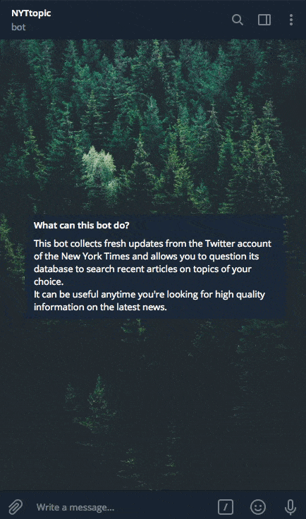

<h1 align="center" >The New York Times Docker Pipeline</h1>

    

<i>Available on Telegram <a href="https://t.me/NYTtopic_bot">@NYTtopic</a></i> 

 

This code maintains a simple <b>Telegram bot</b> which collects fresh updates from the Twitter account of <i>The New York Times</i> and allows the user to look for recent articles on topics of their choice. Hosted on <a href='https://aws.amazon.com/ec2/'><b>Amazon EC2</b></a>, the <a href="https://t.me/NYTtopic_bot">NYTtopic Bot</a> consists of a pipeline of Docker containers:  
  
➤&nbsp;a <b>first container</b> runs a Python module which leverages <a href='https://www.tweepy.org'>Tweepy</a> for accessing <i>The New York Times</i>'s profile via the <a href='https://developer.twitter.com/en/docshttps://developer.twitter.com/en/docs'>Twitter API</a>, creating a stream of tweets and storing these into a <a href='https://www.mongodb.com/'>Mongo database</a> (<b>second container</b>);
 
  
➤&nbsp;the <b>third container</b> carries out ETL tasks. It uses <a href='https://spacy.io'>SpaCy</a> to perform <a href='https://en.wikipedia.org/wiki/Named-entity_recognition'><b>named-entity recognition (NER)</b></a> on the text of each tweet extracted from MongoDB. These tags are then formatted as <i>#hashtags</i>, and all the data are eventually stored into a <a href='https://www.postgresql.org'>PostgreSQL database</a> (<b>fourth container</b>);
 
➤&nbsp;the <b>fifth container</b> feeds all the data into the Telegram bot, which is controlled and kept online using a library called <a href='https://python-telegram-bot.readthedocs.io/en/stable/'>Python Telegram Bot</a>.
 I hope this bot will be useful anytime you are looking for high quality information.   

---

### Used Technology

         <b>Guest Star</b> 
  

---

### Instructions For Using This Code Locally

#### 📌&nbsp; STEP 1: Obtain credentials for the [Twitter API](https://developer.twitter.com/en/docshttps://developer.twitter.com/en/docs) and the [Telegram Bot API](https://core.telegram.org/bots/api)

- Open profiles on [Twitter](https://twitter.com/) and [Telegram](https://telegram.org/) if you do not already have them. 
- Four authentication keys are needed to access Twitter's Streaming API: **API Key**, **API Secret**, **Access Token** and **Access Token Secret**:
  - You can obtain them by registering an application on [apps.twitter.com](https://apps.twitter.com/).
  - Once in possession of the access keys, store them locally as _environment variables_ with the following names: `API_KEY`, `API_SECRET`, `ACCESS_TOKEN`, `SECRET_ACCESS_TOKEN`.

- Authentication to Telegram Bot Api is coparatively easier, as you only need one **Access Token**:
  - To generate it, you have to chat with [BotFather](https://core.telegram.org/bots#6-botfather) on Telegram (no kidding!) and follow a few simple steps (to prevent overlapping, please make sure you do not choose [NYTtopic](https://t.me/NYTtopic_bot) as a name for your bot&nbsp;🙏🏻).
  - Once again, store the token as an _environment variable_. Call it `TOKEN_TELEGRAM`.

#### 📌&nbsp; STEP 2: Run the pipeline with Docker

- Clone this repository and install [Docker](https://www.docker.com/get-started) if needed.
- Go into the folder `NYTopic_twitter_to_telegram`:
  - run `docker-compose build` and wait for Docker to set up everything for you;
  - run `docker-compose up`. The bot should start responding within a few seconds.
- Open a Telegram chat with your new bot and start browsing *The New York Times*!

---

### To Do

- [ ] Add a container for removing old records from Mongo and Postgres.
- [ ] Provide the user with links to similar content in other newspapers.
- [ ] Make hashtag-based queries possible, so as to return all the articles related to a precise topic available in a single message.

